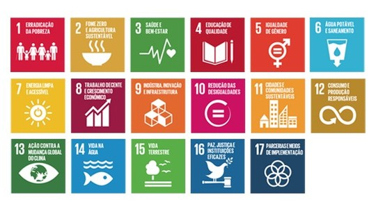

# GeracaoDoAmanha

Projeto da Faculdade para obter nota na APS do segundo semestre pelo curso de Ciência da Computação.
Projeto trata-se da criação de um software que ensina o usuário sobre a Agenda 2030 e a Geração do Amanhã.
E tem interações com a ideia de educar o usuário a se tornar mais sustentável.
